# Lane Crawler


## Introduction
#### Requirements
[Python3.x](https://www.python.org/download/releases/3.0/)  
[NumPy](http://www.numpy.org/)  
[OpenCV](http://docs.opencv.org/3.0-beta/index.html)  
[Moviepy](https://zulko.github.io/moviepy/_modules/moviepy/video/io/VideoFileClip.html)
[Jupyter Notebook](http://jupyter.org/)  

#### Run
The project is currently presented as a lab. The wrapped up pipeline can be found in [lab.ipynb](./lab.ipynb). Just run it in order and you can see all the features of the library.

Basically, the lab is for marking lane and drivable area on experimental video provided by [Udacity](https://www.udacity.com/).

Below are clips of the results:


#### Map
* All the tools is stored in [./utils](./utils):  
    [eye.py](./utils/eye.py): for camera-related operations: camera calibration and distortion correction, as well as the perspective transformation.     

    [thresholding.py](./utils/thresholding.py): for generating binary mask according to color and gradient information.

    [lane_track.py](./utils/lane_track.py): for tracking lane given a binary mask  

    [factory.py](./factory.py): wrapping up all the steps and processing video frame.  

* All the output images are stored in [./output_images](./output_images), names for children folders indicate the intermediate stage of the process.

* [./test_images](./test_images) stored the test image files comes from the [original repo] and captures of the [challenge video](./challenge_video.mp4). Those images are for experiments

* Output for Project Video: https://www.youtube.com/watch?v=hwuhuSPlFow

* Output for Challenge video: https://www.youtube.com/watch?v=iB5Mxc0mzfo


## Camera Calibration and Fix Distortion
All the outputs for this step are stored in [./output_images](./output_images)

#### Big Idea
A common digital camera uses lens to get more light to form the image, which will introduce distortions. This will affect the result of perspective transformation in later steps. Therefore we should fix it first.

The `undistort_eye` class in the `eye.py` module takes in a path with distorted chessboard calibrates the camera and store a undistort model. When `cal_undist` is called, it will undistort a image taken with this camera.

Here are some important code


#### Build the `undistort_eye`  
* The definition of `undistort_eye` can be found in [eye.py]('./utils/eye.py')
```
undist_eye = undistort_eye(clb_path, 9, 6)
```
* The eye is initialized with the `clb_path`, where the original chessboards are stored, and their pattern(9x6 above, should be all the same).

* The eye object reads all the images in the path and detect the corners on the chessboards as image points:
```
ret, corners = cv2.findChessboardCorners(gray, (nx,ny), None)
```

* Calculate the matrix and distortion coefficients for undistorting images taken by this camera:  
```
self.ret, self.mtx, self.dist, self.rvecs, self.tvecs = cv2.calibrateCamera(
                           objpoints, imgpoints, gray.shape[::-1],None,None)
```

#### Use the `undistort_eye`  

```
undist = undistort_eye.cal_undist(img)
```
This will return the undistorted image.


#### Examples:
Below are two examples before and after undistortion, All the undistorted images is stored in [./output_images/camera_cal](./output_images/camera_cal)

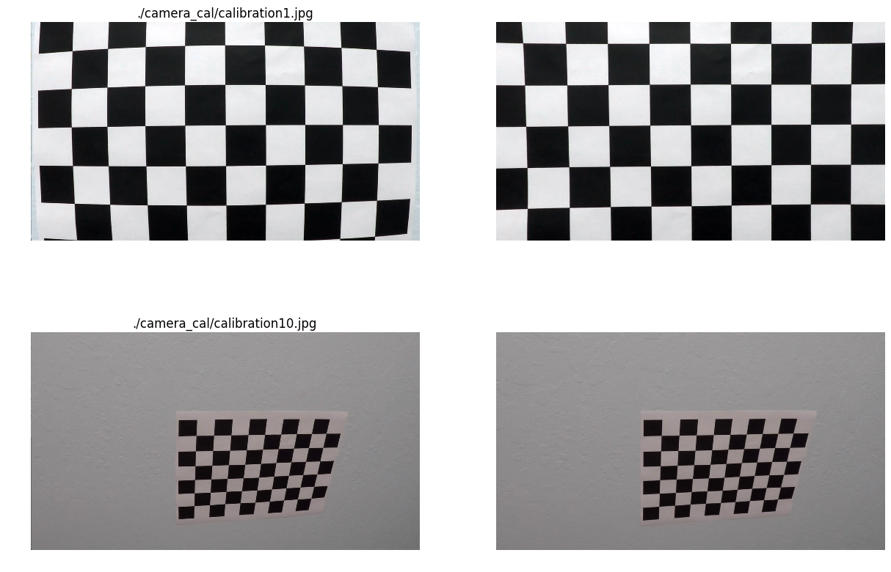


---
## Perspective Transformation
All the output for this step is stored in [./output_images/warped](./output_images/warped)


#### Big Idea
In the later steps in the pipeline, we will see perspective transformation is essential step that makes lane tracking easier and allows curvature measurement.

#### Build the `depth_eye`
* `depth_eye` is a simple wraping of the opencv perspective transformation. It stores transformation matrix and inverse transformation matrix for a specific mounted state of a camera and make it easy to transform any image taken in this state into bird's-eye view.

* To get the two matrix, you need to manually select the source points and destination points and create the eye with:
```
p_eye =  depth_eye(standard_img.shape, src, dst)
```

#### Use the `depth_eye`
Simply call this:
```
birdview = p_eye.transform(img)
```


#### Examples

From the test images select a standard for perspective transformation, here I pick the one where the lane is quite straight onward, so that we can easily figure out the source and the destination.

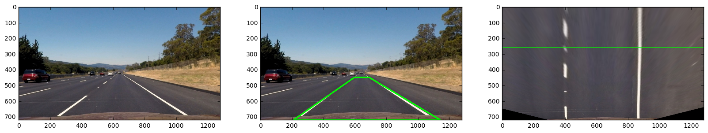

NOTE: The green lines on the unwarped image is for calculating meters per pixel in the y direction. This is for calculating radius of curvature in later steps.
The broken lane standard was found in [California Traffic Manual](http://www.dot.ca.gov/trafficops/camutcd/docs/CAMUTCD2014-Part3_rev1.pdf)

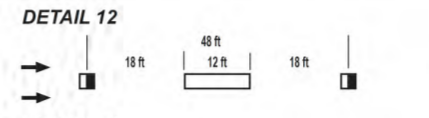

```
top = 260
btm = 530
broken_part = 14.64

cv2.line(warped, (0, top), (1280, top), color = green, thickness = 2) # for calibrating the lane line
cv2.line(warped, (0, btm), (1280, btm), color = green, thickness = 2)

mpp_y = broken_part/(btm - top)
```

#### Inconvenience:
As shown in the frame of the challenge video, although we have the same mounted position of the camera,  up-down angle of the camera or tyre pressure can affact the perspective transformation. So the transformation matrix should be tuned from time to time or handled by a regression model.
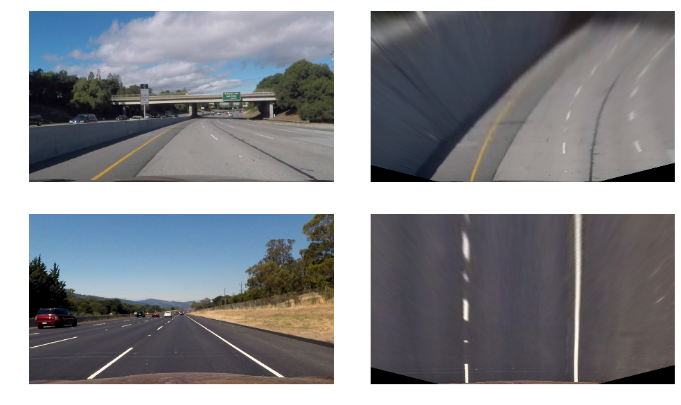

We should refit the camera for the challenge video
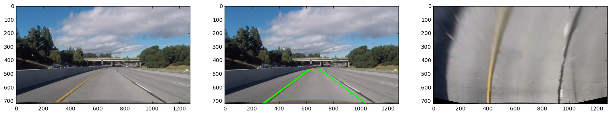

---

## Isolating Channels

#### Big Idea
Before diving into color selection and gradient selection, I decided to check different channels in different color space to see which ones are the best to do the job.


#### Display
I've examined HSV, BGR, HLS, YUV and grayscale channels of the test images. Among them, the HLS, YUV and grayscale channels are the most promising in isolating information

* HLS
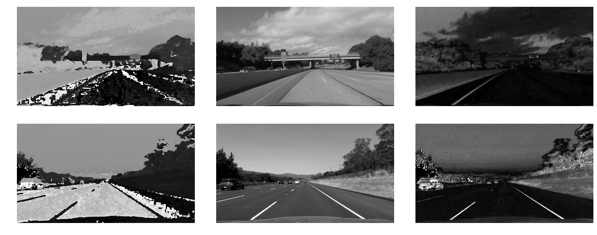


* YUV
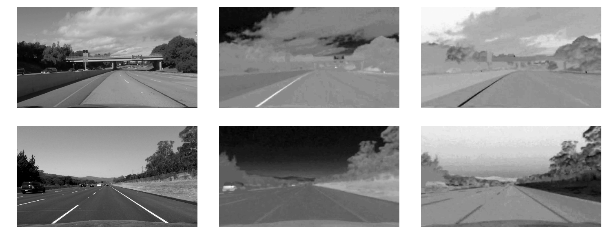


* grayscale  
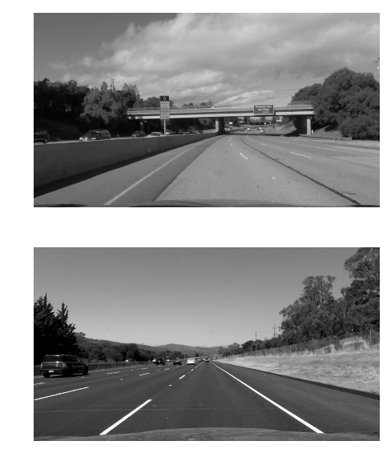


---

## Color Selection
I manually tune the threshold and try multiple combination of the color mask in the following cell.


#### Implementation
I wrote thresholding functions for color selection and gradient selection on a single channel, the code can be found in [thresholding.py](./utils/thresholding.py)

Both functions return a binary map for the color thresholding or gradient thresholding, which I will use for doing combinations with other binary maps returned by the same functions but with different arguments.

Here is an example:
```
gray = np.mean(img, 2)
mask_gray = color_threshold(gray, thres = (196, 255)
```

#### Yellow and White
For now, we are interested about yellow and white lanes, the former turns out outstanding in V channel of YUV color space, and the latter is high in all three RGB channels, higher mean value means a pixel is more close to white. Check [./output_images/color_mask](./output_images/color_mask) for all the output images for this step.


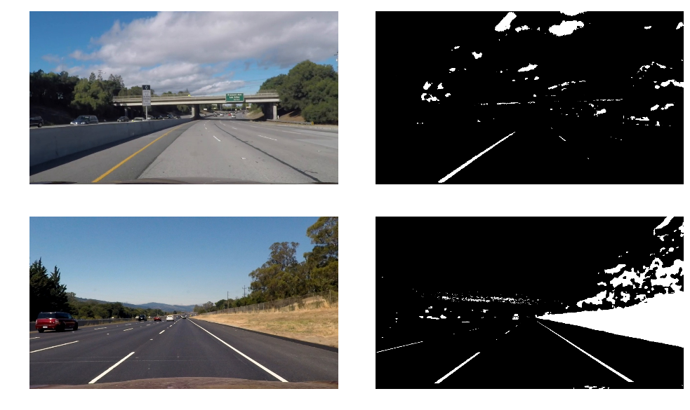


I define my color mask as follow


```python
def color_mask(img):
    gray = np.mean(img, 2)
    mask_gray = color_threshold(gray, thres = (196, 255)) # good at finding write lane
    v = cv2.cvtColor(img, cv2.COLOR_RGB2YUV)[:,:,2]
    mask_v = color_threshold(v, thres = (0, 110)) # good at finding yellow lane
    mask = (mask_gray | mask_v)
    return mask
```

----

## Select Gradient
Like what I did in color selection, I tried multiple gradient types, kernel sizes and threshold. The final output images are in [./output_images/gradient_mask](./output_images/gradient_mask)

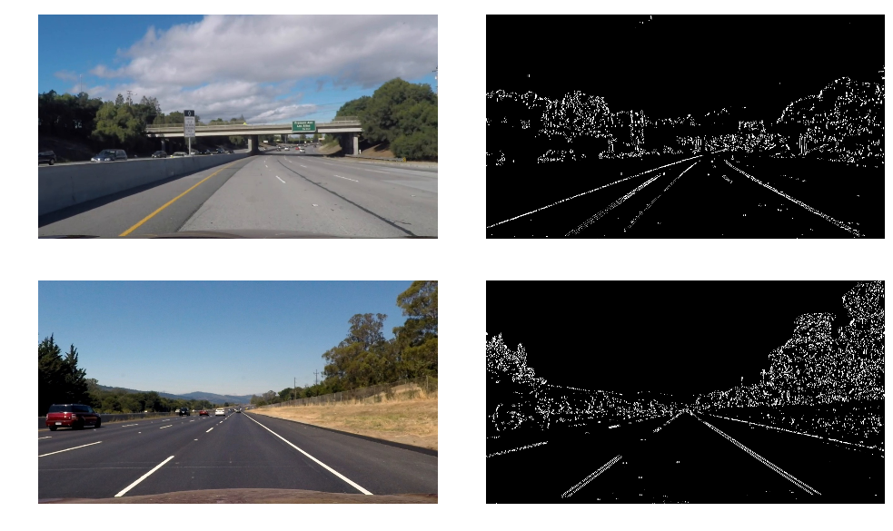

And below is what the final mask looks like
```python
def gradient_mask(img):
    chs = cv2.cvtColor(img, cv2.COLOR_RGB2HSV)
    mask_mag_1 = gradient_threshold(chs[:,:,2], type = 'magnitude', kernelx = 17, kernely = 1, thres = (40, 80)).astype(np.float32)
    mask_mag_2 = gradient_threshold(chs[:,:,2], type = 'magnitude', kernelx = 3, kernely = 1, thres = (40, 100)).astype(np.float32)
    mask = np.zeros_like(img[:,:,2])
    mask[(mask_mag_2 - mask_mag_1) > 0] = 1
    return mask
```

---
## Combination of Masks
below are how the combination of the color mask and gradient mask looks like. I simply use the bitwise or operation to combine the two mask defined above.


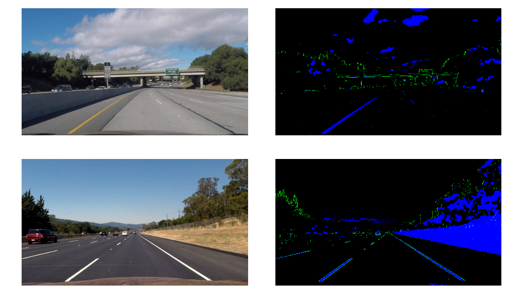


## Lane tracking
#### Big Idea
In the previous step, we get a binary mask for the picture where the lane is isolating from most of the other objects. I use this mask as a source to detect the lane.

When we don't have any prior knowledge about where the lanes are, we calculate the histogram of pixel along the horizontal axis. Since the lanes are roughly going horizontally, we expect peak on where the lanes are. Then we start from the bottom of the binary mask and do a sliding window trick to gradually crawl all the pixels of the lane. Finally, we fit a polynomial model to those pixels and the fit is approximately the trajectory of the lane.

If we've already got a polynomial model, we do not need to do the tedious sliding windows trick to track the lane. all we need is to search a margin centered by the lane to for pixels and update our fit.


#### Implementation
I wrote a class to do all the works mention above. Check the definition of the `tracker` class in [lane_track.py](./utils/lane_track.py)

The tracker can be initialized as follow:
```python
trk = tracker(70, 9, 20, mpp_y = mpp, lane_width = 3.7)
```
The mpp_y calculation and lane_width in the project were based on [California Traffic Manual](http://www.dot.ca.gov/trafficops/camutcd/docs/CAMUTCD2014-Part3_rev1.pdf).

mpp_y means meters per pixel in the y direction, check the Perspective Transformation part to see how to calculate this value.

#### Bias and Radius of Curvature
The typical United State lane width is 3.7 meters. The algorithm uses the polynomial value on the bottom of the binary mask to calculate the width in pixels and the offset is the distance between the midpoint and the center of the lane.
```python
# put text showing meters away center and radius
l_btm = np.polyval(l_fit, self.h)
r_btm = np.polyval(r_fit, self.h)
mpp_x = self.lane_width/(r_btm - l_btm) # meters per pixel

```

Use the following formula to calculate the radius of the curvature:
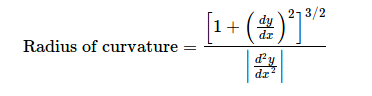  

then apply chain rule to convert pixel to meter, the code looks like below:
```python
radius = (1 + (mpp_x/mpp_y)**2 * (2*A*y + B)**2)**1.5 / abs(2*A*mpp_x/mpp_y**2)
```
I calculate both lines's radius and take the mean.  
Check the function `curvature(self, mpp_x, y_val)` in [factory.py](./utils/factory.py) for details.

I draw the information on the output directly on the road like this:  
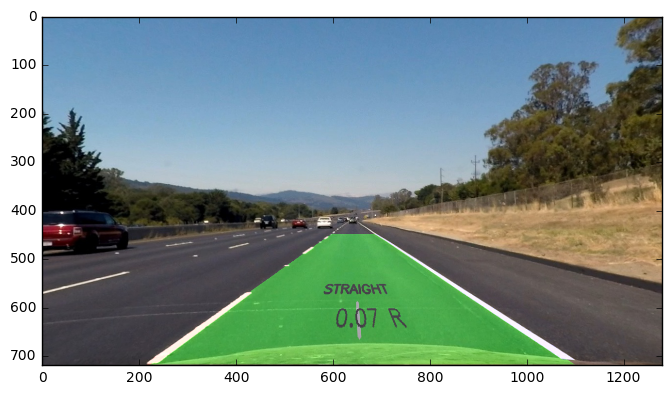

---
## Pipeline
#### The pipeline is shown as follow:

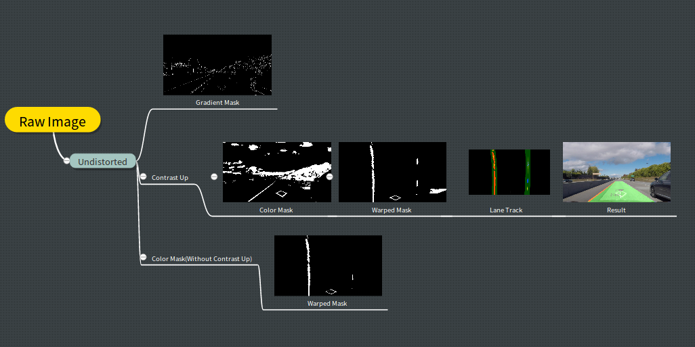
NOTE: I didn't use gradient mask in my final pipeline. See the Robustness and Discussions part for details.

#### Implementation
Create a pipeline object with undistort_eye, depth_eye, tracker, and an assembling list of functions in the process. The definition of `pipeline` can be found in [factory.py](./utils/factory.py)

```python
pipe = pipeline(undist_eye, p_eye, trk, [masking])
```

To use the pipeline, simply call this:  
```python
result = pipe.make(img)
```
or pass it to moviepy.video.io.VideoFileClip
```python
video = clip.fl_image(pipe.make)
```

## Robustness and Discussions


#### Gradient Selection
Roads in real world have patches and sometimes be waterlogged, which will introduce unwanted gradient. To avoid the influences, I think we should give up gradient.  


#### Color Selection
The most annoying situation is darkness and over brightness, the former will swallow all the useful information, and the latter will confuse the detection of white color.  

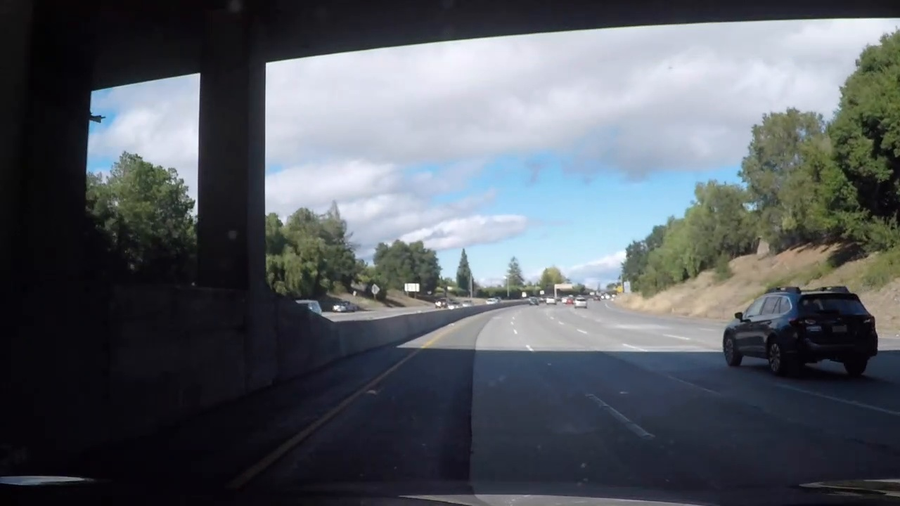
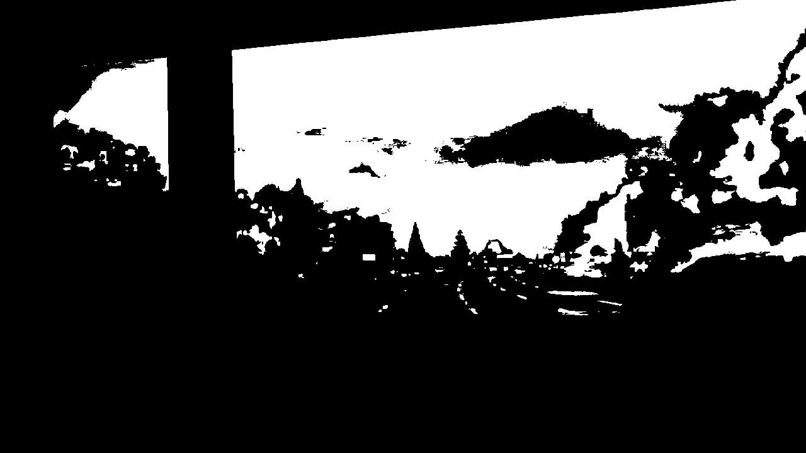


Increasing the contrast of the image makes it easier to identify more yellow and white. I implemented the technique as follow:
Reference: [https://www.packtpub.com/mapt/book/application-development/9781785283932/2/ch02lvl1sec26/enhancing-the-contrast-in-an-image](https://www.packtpub.com/mapt/book/application-development/9781785283932/2/ch02lvl1sec26/enhancing-the-contrast-in-an-image)
```python
def Cup(img, torgb = False):
    cvt = cv2.COLOR_BGR2YUV if torgb else cv2.COLOR_RGB2YUV
    inv = cv2.COLOR_YUV2BGR if torgb else cv2.COLOR_YUV2RGB
    yuv = cv2.cvtColor(img, cvt)
    clahe = cv2.createCLAHE(clipLimit = 1.5, tileGridSize = (8,8))
    yuv[:,:,0] = clahe.apply(yuv[:,:,0])
    result = cv2.cvtColor(yuv, inv)
    return result
```
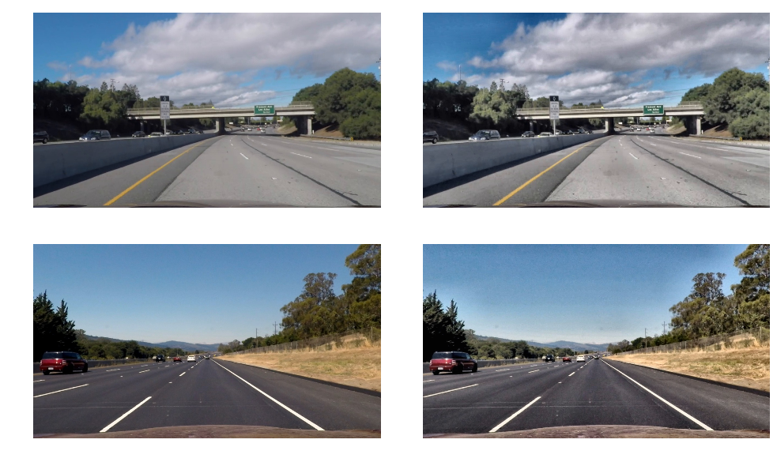

#### Tuning the Tracker
The current polyfit in a lane tracker instance is the memory of the previous lane. And we can control when the fit should be updated by tuning the `curv_count` argument. Check the definition of the [tracker](./utils/factory.py) for details.

#### The Challenge Video
For the challenge video, we should refit the perspective transformation and introduce high contrast in the pipeline. Also, we will initialize a new tracker.
```python
challenge_trk = tracker(15, 9, 20, mpp_y, frac = 2, curv_count = 1570)
challenge_pipe = pipeline(undist_eye, challenge_eye, challenge_trk, [Cup, masking])
```
Please check the output video [here](https://www.youtube.com/watch?v=hwuhuSPlFow)

#### Using Machine Learning/Deep Learning
We can of course use convolution neural network to learn the polynomial model directly or just learn the perspective transform automatically and still use other part of the pipeline.
